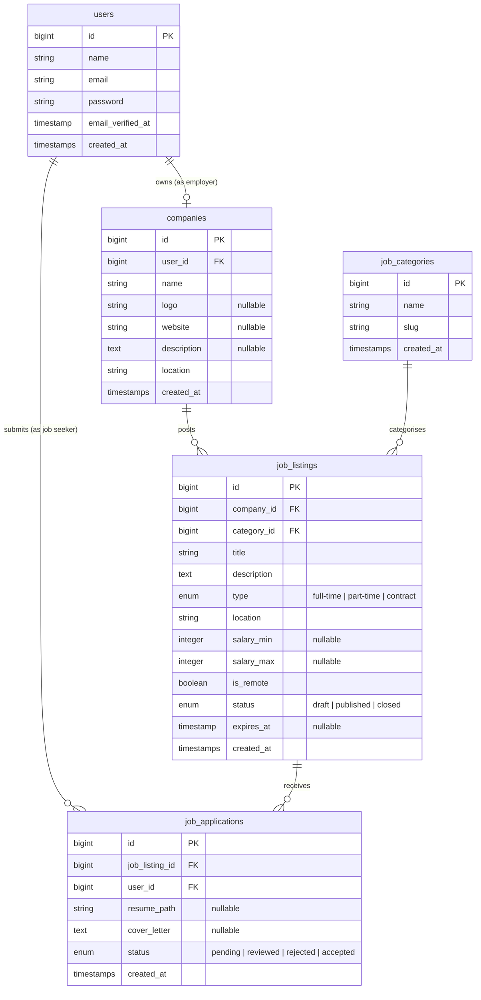

# Database Schema

Entity relationship diagram for the job board. Open in VS Code with the "Markdown Preview Mermaid Support" extension, or view on GitHub — it renders automatically.

---

## Relationships in plain English

| Relationship | Meaning |
|---|---|
| User → Company | An employer creates one company profile |
| Company → JobListings | A company posts many job listings |
| JobCategory → JobListings | A category groups many job listings |
| JobListing → JobApplications | A job listing receives many applications |
| User → JobApplications | A job seeker submits many applications |

## Two roles, one User table

A `User` can be either a **job seeker** or an **employer** (or both). We'll add an `is_employer` boolean to the `users` table in Module 6 when we get to authorization. For now, the distinction is:

- **Employer** — has a `Company`, posts `JobListings`
- **Job seeker** — submits `JobApplications`

## What we are NOT building (yet)

- Tags / skills on job listings
- Saved/bookmarked jobs
- Messaging between employer and applicant
- Admin panel
